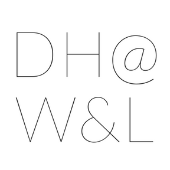
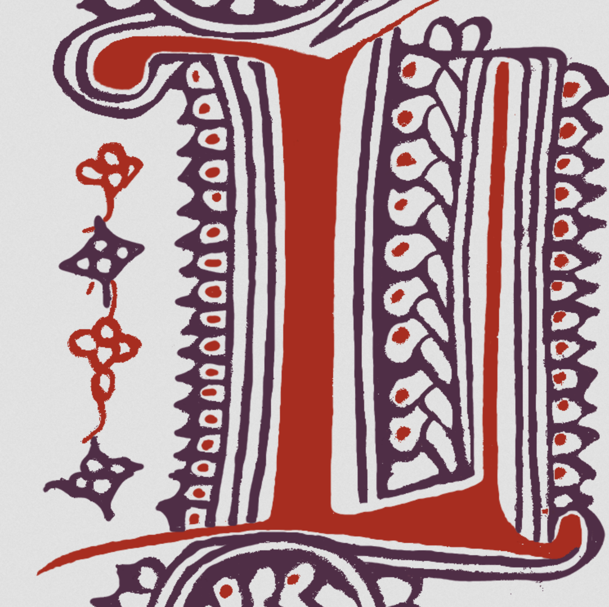
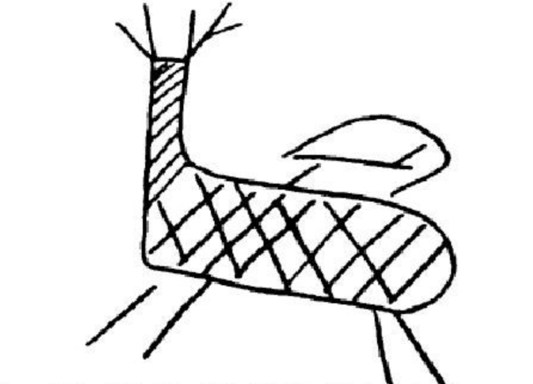
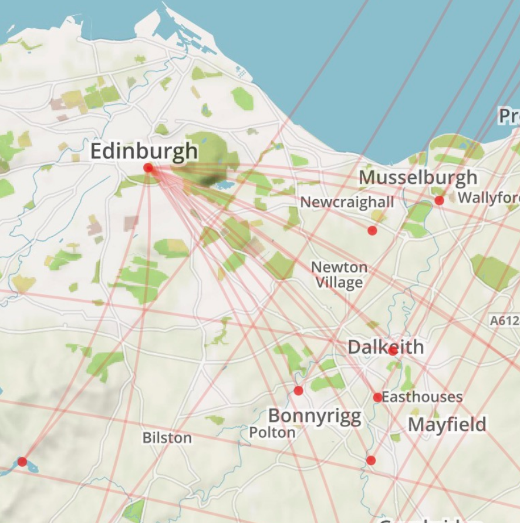
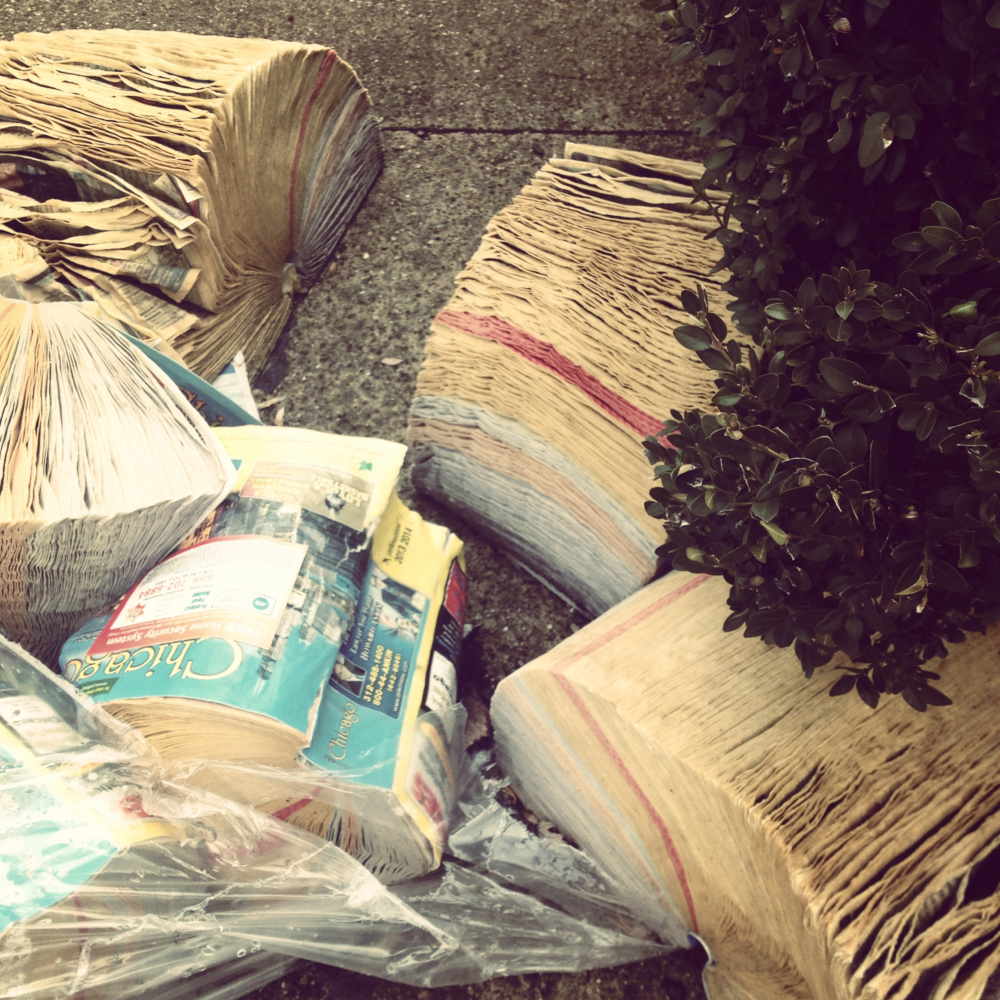

## >>  digital humanities 

### Digital Humanities @ Washington and Lee University

Mellon-funded Digital Humanities initiative that includes speaker series, incentive grants, summer research, and undergraduate fellowship. 

[website](https://digitalhumanities.wlu.edu/) &#124; [GitHub](http://www.github.com/wludh) 

### Huon d'Auvergne Digital Edition

This NEH-funded digital edition project presents the unpublished Franco-Italian medieval epic *Huon d'Auvergne*. 

[project website](http://www.huondauvergne.org/) 

### Ancient Graffiti Project

A digital resource for locating and studying handwritten inscriptions of the early Roman empire.

[project website](http://ancientgraffiti.org/Graffiti/) &#124; [data repo](https://github.com/AncientGraffitiProject/data)

### Mapping the Scottish Reformation

A database of the Scottish clergy, 1560 to 1689

[project website](http://mappingthescottishreformation.org/)

## >> personal

### Biblioclast

A questioning of the book as object. 

[Biblioclast Tumblr](http://biblioclast505-blog.tumblr.com/) &#124; [Vimeo](https://vimeo.com/61151183)

### Self-Preservation Series
A workshops series dedicated to the questions: why preserve? why collect? why not preserve? why not collect? These workshops were carried out at the Read/Write Library during 2012-2013. 

[website](https://preserveanddestroy.wordpress.com/)

